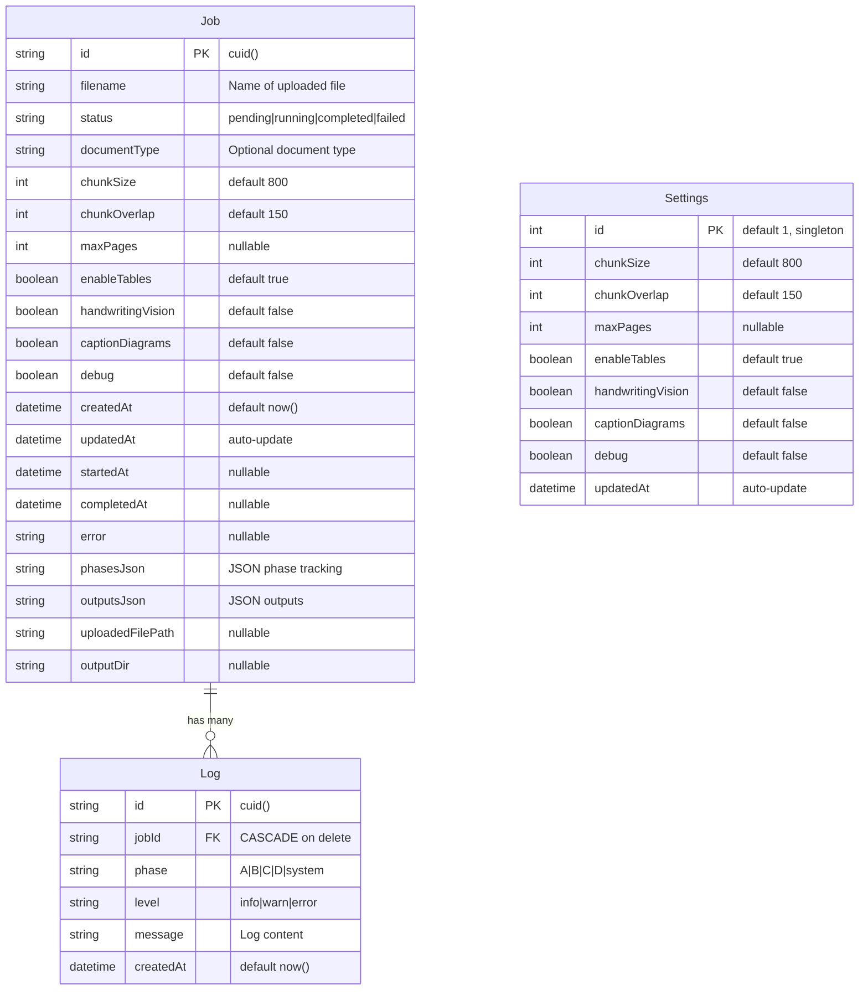

# Database Schema (Prisma + SQLite)

This document describes the current database schema for the PDF Preprocessor application.

## Overview

- **ORM**: Prisma Client
- **Database**: SQLite (`dev.db` in project root)
- **Total Tables**: 3
- **Total Relationships**: 1 (Job → Log, one-to-many with CASCADE delete)

## Entity-Relationship Diagram



## Table Details

### Job Table

Stores preprocessing job metadata, configuration, and status tracking.

**Key Columns:**
- `id` (PK): Unique identifier using CUID
- `status`: Job lifecycle state ("pending" → "running" → "completed"/"failed")
- `phasesJson`: JSON-encoded phase statuses with structure:
  ```json
  {
    "A": {"status": "completed", "startedAt": "...", "completedAt": "..."},
    "B": {"status": "completed", ...},
    "C": {"status": "completed", ...},
    "D": {"status": "not_started", ...}
  }
  ```
- `outputsJson`: JSON-encoded processing outputs:
  ```json
  {
    "rawText": "...",
    "cleanedText": "...",
    "chunks": [...],
    "manifest": {...}
  }
  ```

**Configuration Fields:**
- `chunkSize`, `chunkOverlap`, `maxPages`: Text processing config
- `enableTables`, `handwritingVision`, `captionDiagrams`, `debug`: Feature flags

**File Paths:**
- `uploadedFilePath`: Location of uploaded file (e.g., `temp/uploads/{timestamp}-{filename}`)
- `outputDir`: Output directory (e.g., `out/job-{timestamp}`)

### Log Table

Stores per-job log entries organized by phase and severity.

**Key Columns:**
- `jobId` (FK): References `Job.id` with CASCADE delete
- `phase`: Pipeline phase identifier
  - `"A"` = Phase A (Input Normalization)
  - `"B"` = Phase B (Quality Assessment & Routing)
  - `"C"` = Phase C (Export Content)
  - `"D"` = Phase D (Vision Enrichment)
  - `"system"` = System-level events (job creation, completion, errors)
- `level`: Log severity ("info" | "warn" | "error")

**Indexes:**
- `jobId` (for efficient job log queries)
- `phase` (for phase-based filtering)

### Settings Table

Global default configuration (singleton pattern).

**Special Notes:**
- Only one record exists with `id = 1`
- Values serve as defaults when creating new jobs
- Updated via admin/settings UI

## Relationships

### Job → Log (One-to-Many)

- **Type**: One-to-Many
- **Foreign Key**: `Log.jobId` → `Job.id`
- **On Delete**: CASCADE (deleting a job deletes all its logs)
- **Purpose**: Track all events and messages for a specific job

**Usage Example:**
```typescript
// Fetch job with all logs
const job = await prisma.job.findUnique({
  where: { id: jobId },
  include: { logs: true }
});

// Logs are automatically deleted when job is deleted
await prisma.job.delete({ where: { id: jobId } });
```

## Schema Location

**Prisma Schema File**: `prisma/schema.prisma`
**Migration Files**: `prisma/migrations/`
**Database File**: `dev.db` (SQLite, in project root)

## Modifying the Schema

1. Edit `prisma/schema.prisma`
2. Run `npx prisma migrate dev --name <migration_name>`
3. Prisma Client is auto-generated on migration
4. Update TypeScript types if needed

## See Also

- [Pipeline Architecture](./pipeline.md) - How the system processes jobs
- [Prisma Schema Reference](../../prisma/schema.prisma) - Source schema file
- [Phase Documentation](../) - Detailed phase implementation docs
