# Pipeline Architecture & Flow

This document describes the complete end-to-end processing pipeline for the PDF Preprocessor application.

## Overview

The system operates in **two modes**:

1. **CLI Mode**: Direct command-line execution via `npm run dev <file>`
2. **Web Mode**: Next.js application with background job processing

Both modes converge on the same core pipeline (`src/pipeline.ts`) which orchestrates the 4-phase document preprocessing workflow.

## Pipeline Flow Chart

```mermaid
flowchart TD
    %% CLI Mode Entry
    CLI_Entry[CLI Entry Point<br/>src/index.ts<br/>User runs: npm run dev file.pdf]
    CLI_Exit[CLI Exit<br/>Print stats, exit process]

    %% Web Mode Entry & Job System
    File_Upload[File Upload<br/>POST /api/jobs<br/>Save file + Create Job record]
    Job_Runner_Init[Job Runner Init<br/>lib/initJobRunner.ts<br/>Auto-start on server boot]
    Job_Polling[Job Polling Loop<br/>lib/jobRunner.ts<br/>Check for pending jobs every 3s]
    Job_Processing[Job Processing<br/>lib/jobRunner.ts:processJob<br/>Update status: running]
    Preprocessor_Adapter[Preprocessor Adapter<br/>lib/preprocessorAdapter.ts<br/>Build config, call pipeline]
    Job_Complete[Job Complete<br/>Update status: completed<br/>Save outputs + phases]
    Job_Failed[Job Failed<br/>Update status: failed<br/>Save error message]

    %% Core Pipeline Orchestrator
    Pipeline_Orchestrator[Pipeline Orchestrator<br/>src/pipeline.ts:runPipeline<br/>Coordinates all phases]

    %% Phase A: Normalization
    Phase_A_Normalize{Phase A: Input Normalization<br/>src/normalizeInput.ts<br/>Detect file type}
    Phase_A_PDF[PDF Path<br/>Pass through unchanged<br/>origin: pdf_digital]
    Phase_A_Image[Image Path<br/>Normalize: auto-rotate, grayscale, contrast<br/>origin: image_normalized]

    %% Azure Analysis
    Azure_Analyze[Azure Document Intelligence<br/>src/analyzePdf.ts<br/>API Call: prebuilt-layout model]

    %% Phase B: Routing
    Phase_B_Route[Phase B: Quality Assessment & Routing<br/>src/routeContent.ts<br/>Classify quality + Route content]

    %% Phase D: Vision (Optional)
    Phase_D_Vision[Phase D: Vision Enrichment OPTIONAL<br/>src/handwritingPipeline.ts<br/>OpenAI Vision: Transcribe handwriting]
    Phase_D_Check{handwritingVision<br/>flag enabled?}

    %% Phase C: Export
    Phase_C_Narrative[Phase C: Export Narrative<br/>src/exportNarrative.ts<br/>Chunk text → Markdown files]
    Phase_C_Tables[Phase C: Export Tables<br/>src/exportTables.ts<br/>Merge multi-page → CSV + Summaries]
    Phase_C_Diagrams[Phase C: Export Diagrams<br/>src/exportDiagrams.ts<br/>Optional vision captions → JSON stubs]

    %% Manifest Generation
    Manifest_Gen[Manifest Generation<br/>Build manifest.json<br/>Calculate stats]

    %% CLI Mode Flow
    CLI_Entry --> Pipeline_Orchestrator
    Pipeline_Orchestrator --> CLI_Exit

    %% Web Mode Flow
    File_Upload -->|Creates Job status=pending| Job_Runner_Init
    Job_Runner_Init -->|Starts polling| Job_Polling
    Job_Polling -->|Finds pending job| Job_Processing
    Job_Polling -->|No jobs| Job_Polling
    Job_Processing -->|Call pipeline| Preprocessor_Adapter
    Preprocessor_Adapter --> Pipeline_Orchestrator

    %% Pipeline orchestrator branches to phases
    Pipeline_Orchestrator --> Phase_A_Normalize

    %% Phase A branching
    Phase_A_Normalize -->|PDF| Phase_A_PDF
    Phase_A_Normalize -->|Image| Phase_A_Image
    Phase_A_PDF --> Azure_Analyze
    Phase_A_Image --> Azure_Analyze

    %% Azure to Phase B
    Azure_Analyze --> Phase_B_Route

    %% Phase B to Phase D (optional) or Phase C
    Phase_B_Route --> Phase_D_Check
    Phase_D_Check -->|Yes| Phase_D_Vision
    Phase_D_Check -->|No| Phase_C_Narrative
    Phase_D_Vision --> Phase_C_Narrative

    %% Phase C sequential flow
    Phase_C_Narrative --> Phase_C_Tables
    Phase_C_Tables --> Phase_C_Diagrams
    Phase_C_Diagrams --> Manifest_Gen

    %% Manifest back to modes
    Manifest_Gen -->|CLI Mode| CLI_Exit
    Manifest_Gen -->|Web Mode| Preprocessor_Adapter
    Preprocessor_Adapter -->|Success| Job_Complete
    Preprocessor_Adapter -->|Error| Job_Failed
    Job_Complete --> Job_Polling
    Job_Failed --> Job_Polling

    %% Styling
    classDef cliNode fill:#e1f5ff,stroke:#01579b,stroke-width:2px
    classDef webNode fill:#f3e5f5,stroke:#4a148c,stroke-width:2px
    classDef phaseNode fill:#e8f5e9,stroke:#1b5e20,stroke-width:2px
    classDef optionalNode fill:#fff9c4,stroke:#f57f17,stroke-width:2px,stroke-dasharray: 5 5
    classDef decisionNode fill:#ffe0b2,stroke:#e65100,stroke-width:2px
    classDef errorNode fill:#ffcdd2,stroke:#b71c1c,stroke-width:2px

    class CLI_Entry,CLI_Exit cliNode
    class File_Upload,Job_Runner_Init,Job_Polling,Job_Processing,Preprocessor_Adapter,Job_Complete webNode
    class Phase_A_Normalize,Phase_A_PDF,Phase_A_Image,Azure_Analyze,Phase_B_Route,Phase_C_Narrative,Phase_C_Tables,Phase_C_Diagrams,Pipeline_Orchestrator,Manifest_Gen phaseNode
    class Phase_D_Vision,Phase_D_Check optionalNode
    class Job_Failed errorNode
```



## Node Type Legend

| Color | Node Type | Description |
|-------|-----------|-------------|
| 🔵 **Light Blue** | CLI Mode | Command-line execution path |
| 🟣 **Purple** | Web Mode | Web application job system |
| 🟢 **Green** | Core Pipeline | Processing phases A/B/C and Azure API |
| 🟡 **Yellow (Dashed)** | Optional Phase | Phase D vision features (gated by flags) |
| 🟠 **Orange** | Decision Point | Branching logic (file type, feature flags) |
| 🔴 **Red** | Error Path | Job failure handling |

## Phase Descriptions

### Phase A: Input Normalization
**File**: `src/normalizeInput.ts`

**Purpose**: Universal file loader that accepts PDFs and images

**Decision Logic**:
- **PDF Files** (.pdf):
  - Pass through unchanged
  - Mark as `origin: "pdf_digital"`
- **Image Files** (.jpg, .png, .heic, .webp, .tiff):
  - Normalize with `sharp`: auto-rotate (EXIF), grayscale, contrast boost
  - Save as PNG: `{tempDir}/normalized_{basename}.png`
  - Mark as `origin: "image_normalized"`

**Outputs**: `{ normalizedPath, origin }`

---

### Azure Document Intelligence
**File**: `src/analyzePdf.ts`

**Purpose**: Extract structured content from normalized document

**API Call**:
- Service: Azure Document Intelligence
- Model: `prebuilt-layout`
- Returns: `AnalyzeResult` with paragraphs, tables, styles, confidence scores

**Environment Variables**:
- `AZURE_DOC_ENDPOINT`
- `AZURE_DOC_KEY`

**Outputs**: Full Azure `AnalyzeResult` object

---

### Phase B: Quality Assessment & Routing
**File**: `src/routeContent.ts`

**Purpose**: Classify content quality and route into categories

**Quality Classification**:
1. Check if text overlaps handwriting spans (from Azure styles)
2. Check confidence scores
3. Assign quality:
   - `"handwriting"` if handwritten
   - `"low_confidence"` if confidence < 0.9
   - `"ok"` otherwise

**Content Routing**:
- **Narrative**: Azure paragraphs → `NarrativeChunk[]`
- **Tables**: Azure tables → `TableAsset[]` with CSV paths
- **Diagrams**: Page-based stubs → `DiagramAsset[]`

**Metadata Propagated**: `origin`, `quality`, `sourceImagePath`

**Outputs**: `{ narrativeBlocks[], tables[], diagrams[] }`

---

### Phase D: Vision Enrichment (OPTIONAL)
**File**: `src/handwritingPipeline.ts`, `src/visionClient.ts`

**Trigger Conditions**:
- CLI flag: `--handwritingVision`
- Environment: `ENABLE_HANDWRITING_VISION=true`
- Job config: `job.handwritingVision = true`

**Purpose**: Replace low-quality Azure OCR with AI vision transcription

**Processing**:
1. Filter narrative chunks where:
   - `origin === "image_normalized"`
   - `quality === "handwriting"` or `"low_confidence"`
2. Call OpenAI Vision API:
   - Model: `gpt-4o-mini` (configurable via `VISION_MODEL` env var)
   - Prompt: "Transcribe this handwritten racing note exactly..."
3. Replace filtered chunks with single vision-transcribed chunk

**Environment Variables**:
- `OPENAI_API_KEY`
- `VISION_MODEL` (optional, default: "gpt-4o-mini")

**Outputs**: Enriched `narrativeBlocks[]`

**Note**: Diagram captioning is also part of Phase D but runs during `exportDiagrams`

---

### Phase C: Export Narrative
**File**: `src/exportNarrative.ts`

**Purpose**: Generate markdown chunks for RAG ingestion

**Processing**:
1. Group narrative blocks by `sectionPath`
2. Combine text per group
3. Chunk text: 4000 chars max, 500 char overlap (sliding window)
4. Determine worst quality per group
5. Route by quality:
   - `quality === "ok"` → `auto_ok/narrative/`
   - Otherwise → `needs_review/narrative/`

**Outputs**:
- Markdown files: `{outDir}/{qualityBucket}/narrative/{section}_{N}.md`
- Metadata: `NarrativeChunk[]` with file paths

---

### Phase C: Export Tables
**File**: `src/exportTables.ts`

**Purpose**: Merge multi-page tables and export structured data

**Multi-Page Table Merging Algorithm**:
1. Extract header row from each Azure table
2. Generate header signature (normalized, lowercase)
3. Group tables by matching signature
4. For each group:
   - Sort by page number
   - Merge data rows (skip duplicate headers)
   - Use worst quality from all fragments
   - Track page range: `[minPage, maxPage]`

**Outputs Per Logical Table**:
1. **CSV File**: `{outDir}/tables/{source}_table_{N}.csv`
   - Full merged table with all data rows
2. **Summary Document**: `{outDir}/{qualityBucket}/tables/table_{N}_summary.md`
   - Metadata: page range, merge info, row/column counts, header preview
3. **Preview Document**: `{outDir}/{qualityBucket}/tables_previews/table_{N}_preview.md`
   - First 20 rows as markdown table

**Quality Routing**: Same as narrative (`auto_ok/` vs `needs_review/`)

**Returns**: `{ updatedTables[], tableSummaries[] }`

---

### Phase C: Export Diagrams
**File**: `src/exportDiagrams.ts`

**Purpose**: Export diagram metadata with optional vision captions

**Optional Vision Captioning**:
- **Trigger**: CLI flag `--captionDiagrams` OR env `ENABLE_DIAGRAM_CAPTIONING=true`
- **API Call**: OpenAI Vision API
- **Prompt**: "Analyze technical diagram, describe dimensions, limits, constraints..."
- **Effect**: Replace `description` field with generated caption

**Outputs**:
- JSON files: `{outDir}/{qualityBucket}/diagrams/{diagramId}.json`
- Contains full diagram metadata + optional caption

**Quality Routing**: Same as narrative

**Returns**: Updated `DiagramAsset[]` with captions

---

### Manifest Generation
**File**: `src/pipeline.ts` (lines 91-104)

**Purpose**: Create comprehensive output metadata

**Manifest Structure**:
```json
{
  "sourcePdf": "filename.pdf",
  "origin": "pdf_digital" | "image_normalized",
  "narrativeChunks": [...],
  "tableSummaries": [...],
  "tables": [...],
  "diagrams": [...]
}
```

**Statistics Calculated**:
- `okCount`: Content with quality "ok"
- `lowConfidenceCount`: Content with quality "low_confidence"
- `handwritingCount`: Content with quality "handwriting"

**Output**: `{outDir}/manifest.json`

**Returns**: `{ manifest, stats, outputDir }`

---

## Output Directory Structure

```
{outDir}/
├── manifest.json                     # Complete pipeline metadata
├── tables/                           # Raw CSV files (no quality routing)
│   └── {source}_table_{N}.csv
├── auto_ok/                          # High-quality content (quality="ok")
│   ├── narrative/
│   │   └── {section}_{chunk}.md
│   ├── tables/
│   │   └── table_{N}_summary.md
│   ├── tables_previews/
│   │   └── table_{N}_preview.md
│   └── diagrams/
│       └── {diagramId}.json
└── needs_review/                     # Low-quality content (needs human review)
    ├── narrative/
    │   └── {section}_{chunk}.md
    ├── tables/
    │   └── table_{N}_summary.md
    ├── tables_previews/
    │   └── table_{N}_preview.md
    └── diagrams/
        └── {diagramId}.json
```

## Error Handling

### CLI Mode
- Errors propagate to console output
- Process exits with non-zero code
- No persistent error storage

### Web Mode
**File**: `lib/jobRunner.ts:processJob()` (error catch block)

**On Error**:
1. Console log error details
2. **Database Write**: Update Job record:
   ```typescript
   {
     status: 'failed',
     completedAt: new Date(),
     error: error.message
   }
   ```
3. **Database Write**: Create Log entry:
   - `phase: 'system'`
   - `level: 'error'`
   - `message: error.message`
4. Update phase status: Mark currently running phase as 'failed' in `phasesJson`

**Recovery**: Job remains failed; requires manual retry via `/api/jobs/{id}/process`

---

## Alternative Entry Points (Web Mode)

### Manual Job Processing
**Endpoint**: `POST /api/jobs/{id}/process`
**File**: `app/api/jobs/[id]/process/route.ts`

**Purpose**: Bypass job queue and process immediately

**Flow**: Directly calls `JobRunner.processJob(id)` (fire-and-forget)

**Use Case**: Manual retry or priority processing

---

### Job Runner Control
**Endpoints**: `GET/POST /api/runner`
**File**: `app/api/runner/route.ts`

**Actions**:
- `GET`: Check runner status (running/stopped, current job)
- `POST { action: "start" }`: Start background polling
- `POST { action: "stop" }`: Stop background polling

**Use Case**: Admin control of job processing system

---

## Configuration

### Environment Variables
**File**: `.env`

**Required**:
- `AZURE_DOC_ENDPOINT`: Azure Document Intelligence endpoint URL
- `AZURE_DOC_KEY`: Azure Document Intelligence API key

**Optional (Phase D - Vision Features)**:
- `OPENAI_API_KEY`: OpenAI API key for vision models
- `VISION_MODEL`: Vision model name (default: "gpt-4o-mini")
- `ENABLE_HANDWRITING_VISION`: "true" to enable handwriting transcription
- `ENABLE_DIAGRAM_CAPTIONING`: "true" to enable diagram captioning

### Job Configuration
**Source**: Database (`Job` table fields) or CLI arguments

**Fields**:
- `chunkSize` (default: 800): Max characters per narrative chunk
- `chunkOverlap` (default: 150): Overlap between chunks
- `maxPages` (nullable): Optional page limit
- `enableTables` (default: true): Enable table extraction
- `handwritingVision` (default: false): Enable Phase D handwriting transcription
- `captionDiagrams` (default: false): Enable Phase D diagram captioning
- `debug` (default: false): Enable debug mode

---

## Key File Locations

### Core Pipeline
- `src/index.ts` - CLI entry point
- `src/pipeline.ts` - Pipeline orchestrator
- `src/normalizeInput.ts` - Phase A
- `src/analyzePdf.ts` - Azure API integration
- `src/routeContent.ts` - Phase B
- `src/exportNarrative.ts` - Phase C (narrative)
- `src/exportTables.ts` - Phase C (tables)
- `src/exportDiagrams.ts` - Phase C (diagrams)
- `src/handwritingPipeline.ts` - Phase D (handwriting)
- `src/visionClient.ts` - Phase D (vision API)

### Web Job System
- `lib/jobRunner.ts` - Background job processor
- `lib/preprocessorAdapter.ts` - Pipeline adapter for jobs
- `lib/initJobRunner.ts` - Auto-start initialization
- `lib/jobLogger.ts` - Database logging
- `app/api/jobs/route.ts` - Job CRUD endpoints
- `app/api/jobs/[id]/process/route.ts` - Manual processing trigger
- `app/api/runner/route.ts` - Runner control

### Utilities
- `src/utils/fsUtils.ts` - File system helpers
- `src/utils/chunkText.ts` - Text chunking algorithm

---

## See Also

- [Database Schema](./database.md) - ER diagram and table details
- [Phase A Summary](../phase-a-summary.md) - Input normalization details
- [Phase B Summary](../phase-b-summary.md) - Quality assessment details
- [Phase C Summary](../phase-c-summary.md) - Export and table merging details
- [Phase D Summary](../phase-d-summary.md) - Vision features details
- [User Guide](../user-guide.md) - Setup and usage instructions
